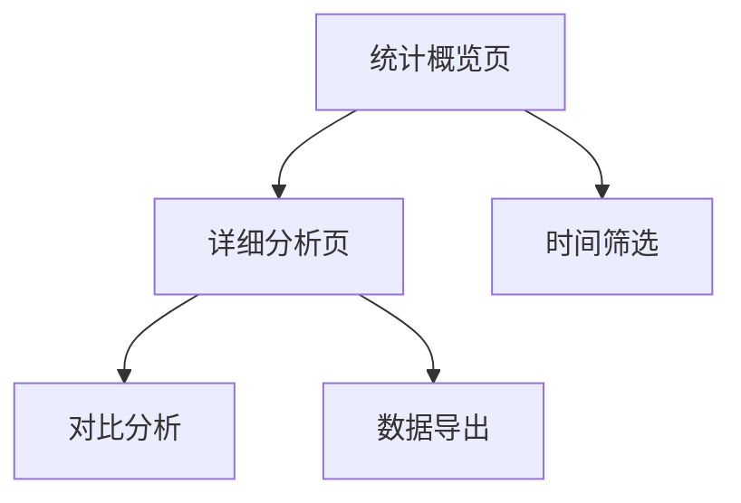

## 1. 产品概述
跟单交易统计分析模块，帮助用户直观了解自己的跟单交易表现。通过多维度数据分析和可视化图表，用户可以快速掌握交易盈亏、胜率、交易习惯等关键指标，并与跟单对象进行对比分析。

## 2. 核心功能

### 2.1 用户角色
| 角色 | 注册方式 | 核心权限 |
|------|----------|----------|
| 普通用户 | 邮箱注册 | 查看个人跟单统计数据、对比分析 |

### 2.2 功能模块
跟单交易统计分析模块包含以下核心页面：
1. **统计概览页**：核心指标总览、图表展示、快速筛选。
2. **详细分析页**：多维度分析、对比分析、数据导出。

### 2.3 页面详情
| 页面名称 | 模块名称 | 功能描述 |
|----------|----------|----------|
| 统计概览页 | 核心指标卡片 | 显示总交易次数、胜率、盈亏比、总盈亏金额等关键指标 |
| 统计概览页 | 交易趋势图 | 展示选定时间范围内的交易金额和盈亏趋势折线图 |
| 统计概览页 | 市场表现饼图 | 按市场分类显示交易分布和盈亏情况 |
| 统计概览页 | 时间筛选器 | 支持按日、周、月、自定义时间范围筛选数据 |
| 详细分析页 | 多维度分析表 | 按市场、时间、金额区间等维度展示详细交易数据 |
| 详细分析页 | 对比分析图 | 用户与跟单对象的胜率、盈亏比等关键指标对比 |
| 详细分析页 | 交易记录表 | 显示具体交易记录，支持排序和筛选 |

## 3. 核心流程
用户进入统计模块后，默认展示近30天的交易数据概览。用户可以通过时间筛选器调整分析范围，点击具体图表或指标可进入详细分析页面查看更细致的数据。

## 4. 用户界面设计

### 4.1 设计风格
- **主色调**：深蓝色 (#1e40af) 体现金融专业性
- **辅助色**：绿色 (#10b981) 表示盈利，红色 (#ef4444) 表示亏损
- **按钮样式**：圆角矩形，悬停效果明显
- **字体**：系统默认字体，数字使用等宽字体便于对比
- **图标风格**：简洁线性图标，使用emoji增强直观性

### 4.2 页面设计概览
| 页面名称 | 模块名称 | UI元素 |
|----------|----------|--------|
| 统计概览页 | 核心指标卡片 | 网格布局，每个指标单独卡片，大字体显示数值，小字体显示标签和变化趋势 |
| 统计概览页 | 交易趋势图 | 占据页面主要空间，使用双轴折线图，支持悬停显示具体数值 |
| 统计概览页 | 市场表现饼图 | 使用环形饼图，中间显示总数，图例清晰标识各市场占比 |
| 详细分析页 | 多维度分析表 | 表格形式，支持排序，关键数据使用颜色标识优劣 |
| 详细分析页 | 对比分析图 | 并排柱状图或雷达图，直观展示用户与跟单对象差异 |

### 4.3 响应式设计
桌面端优先设计，适配移动端显示。在移动设备上，图表会自动调整尺寸，表格会转为卡片式布局，确保在小屏幕上也能清晰展示关键信息。

### 4.4 图表交互指导
- **悬停效果**：鼠标悬停时显示详细数值和说明
- **点击交互**：点击图表元素可钻取更详细数据
- **动画效果**：数据加载和切换时有平滑过渡动画
- **颜色规范**：统一使用红绿配色表示盈亏，避免色盲用户困扰