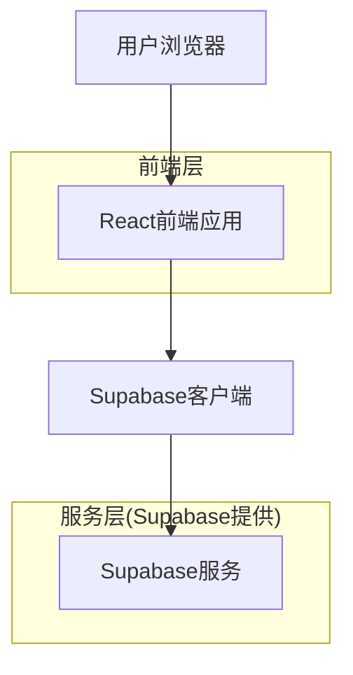
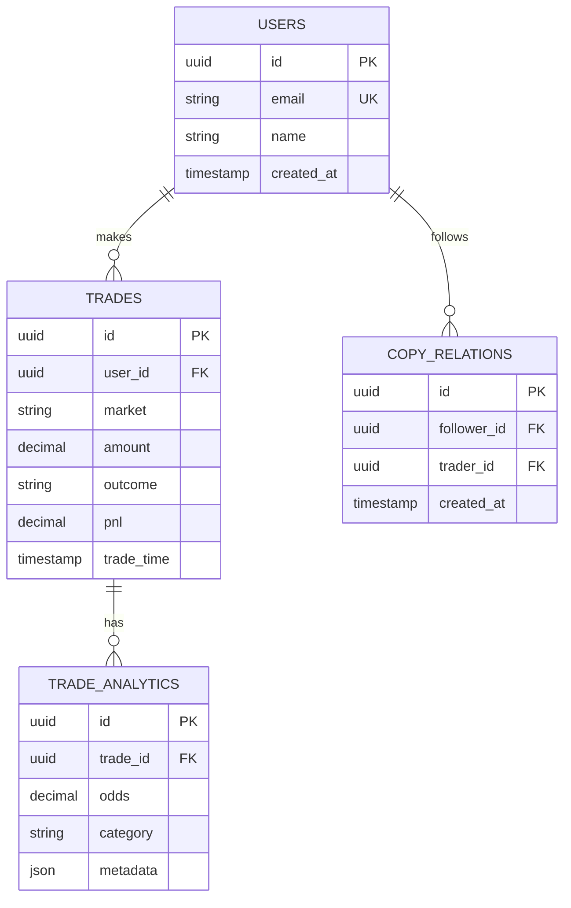

## 1. 架构设计



## 2. 技术描述
- **前端**: React@18 + tailwindcss@3 + vite + chart.js@4 + date-fns
- **初始化工具**: vite-init
- **后端**: Supabase (内置认证、PostgreSQL数据库、实时订阅)

## 3. 路由定义
| 路由 | 用途 |
|------|------|
| /statistics | 统计概览页，显示核心指标和图表 |
| /statistics/detail | 详细分析页，多维度分析和对比 |

## 4. API定义

### 4.1 统计数据API

获取用户交易统计概览
```
GET /api/statistics/overview
```

请求参数:
| 参数名 | 参数类型 | 是否必需 | 描述 |
|--------|----------|----------|------|
| user_id | string | true | 用户ID |
| start_date | string | false | 开始日期(YYYY-MM-DD) |
| end_date | string | false | 结束日期(YYYY-MM-DD) |

响应:
| 参数名 | 参数类型 | 描述 |
|--------|----------|------|
| total_trades | number | 总交易次数 |
| win_rate | number | 胜率(0-1) |
| profit_loss_ratio | number | 盈亏比 |
| total_pnl | number | 总盈亏金额 |

### 4.2 对比分析API

获取用户与跟单对象对比数据
```
GET /api/statistics/comparison
```

请求参数:
| 参数名 | 参数类型 | 是否必需 | 描述 |
|--------|----------|----------|------|
| user_id | string | true | 用户ID |
| trader_id | string | true | 跟单对象ID |

响应:
| 参数名 | 参数类型 | 描述 |
|--------|----------|------|
| user_stats | object | 用户统计数据 |
| trader_stats | object | 跟单对象统计数据 |
| comparison | object | 对比差异数据 |

## 5. 数据模型

### 5.1 数据模型定义


### 5.2 数据定义语言

交易记录表(trades)
```sql
-- 创建交易记录表
CREATE TABLE trades (
    id UUID PRIMARY KEY DEFAULT gen_random_uuid(),
    user_id UUID NOT NULL REFERENCES users(id) ON DELETE CASCADE,
    market VARCHAR(100) NOT NULL,
    amount DECIMAL(15,4) NOT NULL CHECK (amount > 0),
    outcome VARCHAR(20) NOT NULL CHECK (outcome IN ('win', 'loss', 'pending')),
    pnl DECIMAL(15,4) NOT NULL DEFAULT 0,
    trade_time TIMESTAMP WITH TIME ZONE DEFAULT NOW(),
    created_at TIMESTAMP WITH TIME ZONE DEFAULT NOW()
);

-- 创建索引
CREATE INDEX idx_trades_user_id ON trades(user_id);
CREATE INDEX idx_trades_trade_time ON trades(trade_time DESC);
CREATE INDEX idx_trades_market ON trades(market);

-- 权限设置
GRANT SELECT ON trades TO anon;
GRANT ALL PRIVILEGES ON trades TO authenticated;
```

交易分析表(trade_analytics)
```sql
-- 创建交易分析表
CREATE TABLE trade_analytics (
    id UUID PRIMARY KEY DEFAULT gen_random_uuid(),
    trade_id UUID NOT NULL REFERENCES trades(id) ON DELETE CASCADE,
    odds DECIMAL(8,4),
    category VARCHAR(50),
    metadata JSONB DEFAULT '{}',
    created_at TIMESTAMP WITH TIME ZONE DEFAULT NOW()
);

-- 权限设置
GRANT SELECT ON trade_analytics TO anon;
GRANT ALL PRIVILEGES ON trade_analytics TO authenticated;
```

跟单关系表(copy_relations)
```sql
-- 创建跟单关系表
CREATE TABLE copy_relations (
    id UUID PRIMARY KEY DEFAULT gen_random_uuid(),
    follower_id UUID NOT NULL REFERENCES users(id) ON DELETE CASCADE,
    trader_id UUID NOT NULL REFERENCES users(id) ON DELETE CASCADE,
    created_at TIMESTAMP WITH TIME ZONE DEFAULT NOW(),
    UNIQUE(follower_id, trader_id)
);

-- 权限设置
GRANT SELECT ON copy_relations TO anon;
GRANT ALL PRIVILEGES ON copy_relations TO authenticated;
```

### 5.3 统计视图

创建统计视图用于快速查询
```sql
-- 用户交易统计视图
CREATE VIEW user_trade_stats AS
SELECT 
    user_id,
    COUNT(*) as total_trades,
    SUM(CASE WHEN outcome = 'win' THEN 1 ELSE 0 END)::decimal / COUNT(*) as win_rate,
    SUM(CASE WHEN outcome = 'win' THEN pnl ELSE 0 END) / NULLIF(SUM(CASE WHEN outcome = 'loss' THEN -pnl ELSE 0 END), 0) as profit_loss_ratio,
    SUM(pnl) as total_pnl,
    DATE_TRUNC('month', trade_time) as month
FROM trades
GROUP BY user_id, DATE_TRUNC('month', trade_time);

-- 市场分布视图
CREATE VIEW market_distribution AS
SELECT 
    user_id,
    market,
    COUNT(*) as trade_count,
    SUM(pnl) as total_pnl,
    AVG(pnl) as avg_pnl
FROM trades
GROUP BY user_id, market;
```